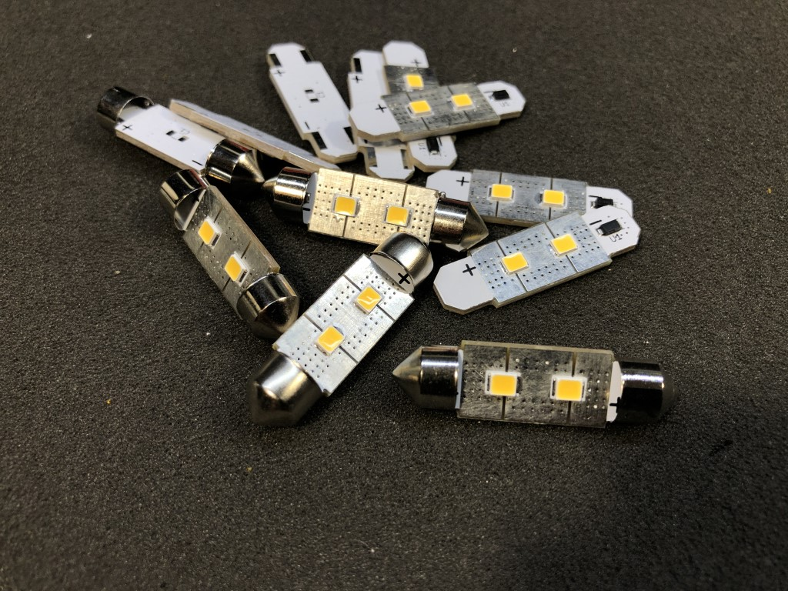

# C5W-LED
This repository holds the source files needed to build the C5W bulbs based on Cree LEDs and a constant current driver (AL5809).

More info about this project in [Voltlog #333](https://youtu.be/id2jNSogrME).
You can also check out the T10 LED bulb project in [Voltlog #319](https://www.youtube.com/watch?v=uEePdwpdCJc).

